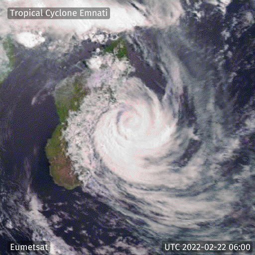

# WMS Animator

Animate WMS data for a given area from a list of time parameters

## Sample Output

Sample output for Tropical Cyclone [Emnati](https://reliefweb.int/disaster/ec-2022-000174-mdg)



## Dependencies

The WMS animator service is built using [Go](https://go.dev/) and  can be executed either natively or using Docker, each of which has its own set of requirements.

Native execution requires:
- [Go](https://go.dev/)

Execution using Docker requires:
- [Docker](https://www.docker.com/)
- [Docker Compose](https://docs.docker.com/compose/)


## Getting started

Start by cloning the repository from github to your execution environment

```
git clone https://github.com/icpac-igad/wms-animator.git && cd wms-animator
```

After that, follow one of the instructions below:

### Using native execution

1 - Install go dependencies using yarn:
```
go get

```

2 - Start the application server:
```
go run main.go
```

The endpoints provided by this microservice should now be available on [http:localhost:9000](http:localhost:9000)

Only one endpoint is currently exposed i.e `/wms`


### Using Docker
1 - Create and complete your `.env`. You can find an example `.env.sample` file in the project root.

2 - Build the the image

`docker-compose build`

3 - Run the container

`docker-compose up`

### Environment variables

- PORT => Target TCP port in which the service will run
- RESTART_POLICY => Docker container restart policy. You will want this set to `always` in production


## `/wms` endpoint usage

This endpoint only accepts `POST` requests with a `json` payload that should look like below

```
{
    "url": "https://eumetview.eumetsat.int/geoserv/wms",
    "wms_params": {
        "LAYERS": "meteosat:msg_naturalenhncd",
        "TRANSPARENT": "TRUE",
        "FORMAT": "image/png",
        "VERSION": "1.3.0",
        "TILED": "TRUE",
        "SERVICE": "WMS",
        "REQUEST": "GetMap",
        "CRS": "EPSG:4326",
        "BBOX": "-31.128199,39.462891,-9.622414,60.820313",
        "WIDTH": "512",
        "HEIGHT": "512"
    },
    "parameter": {
        "name": "TIME",
        "values": [
            "2022-02-22T06:00:00.000Z",
            "2022-02-22T06:15:00.000Z",
            "2022-02-22T06:30:00.000Z",
            "2022-02-22T06:45:00.000Z",
            "2022-02-22T07:00:00.000Z",
            "2022-02-22T07:15:00.000Z",
            "2022-02-22T07:30:00.000Z",
            "2022-02-22T07:45:00.000Z",
            "2022-02-22T08:00:00.000Z"
        ]
    },
    "title": "Tropical Cyclone Emnati",
    "attribution": "Eumetsat"
}
```

- url - the base wms url
- wms_params -  a key value pair of the expected wms parameters. The bbox parameter should exist for the extents of your area of interest. Please check with your wms source for expected WMS params. This service does not validate any params
- parameter
    - name - the dynamic parameter name, usually time
    - values - a list of the different time values, usually in UTC format. This will be ordered from earliest to latest
- title - title for the animation. For example if you are animating a cyclone, this can the the name of the cyclone as in example above
- attribution - map attribution caption, usually the source of the imagery

This sample configuration will give you an output similar to the sample shown above.